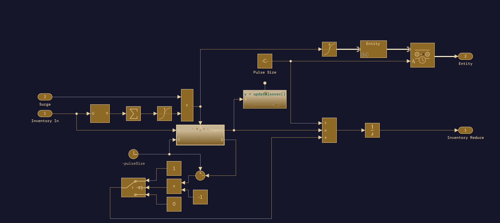
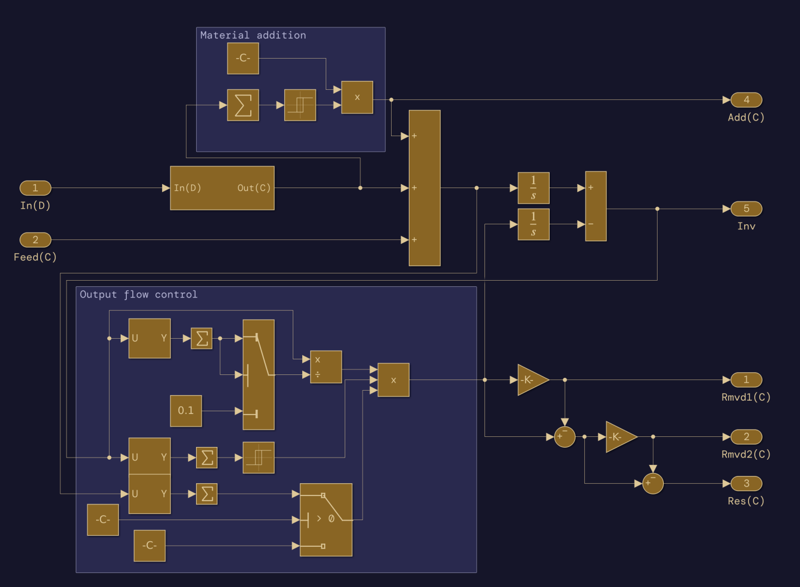

  

  
  
  

---

F3M (Fissile Facility Flow Modeler) is a library of components for [MATLAB Simulink](https://www.mathworks.com/products/simulink.html) that can be used to create models of nuclear facilities. To use this library, you will need a license for MATLAB, Simulink, and Simevents.

The components of F3M are divided into either common or for a specific facility type. We provide basic instructions on how initialize and configure modules, but specifics arrangements and configurations of blocks (i.e., how to make a complete model) is out-of-scope for this project. The authors of this repository, the Sandia Nuclear Fuel Cycle and Safeguards Group, also develops facility models from the F3M library. These models, called the Separation and Safeguards Performance Model Library (SSPM-L) is not publicly available but can be requested by contacting us at [MAPIT-dev@sandia.gov](mailto:MAPIT-dev@sandia.gov).  

* [Features](#features)
* [Development](#development)
* [Installation](#installation)
* [Getting Started](#getting-started)
* [Contact](#contact)
* [Data Privacy](#data-privacy)
* [License](#license)

## Features

    
  
  

The Fissile Facility Flow Modeler (F3M) is an open source series of modules intended to facilitate the development of nuclear facility models in MATLAB Simulink for safeguards research. F3M consists of several libraries divided into facility type. This library is target towards modeling material flows and operations without specific operational details. For example, one generic block is the [generic flow batcher](./docs/source/common_blocks/flow_batch_g.md). This block exposes parameters that describe the behavior of a batching operation such as batch target size and residual size, but does not describe dimensions or mechanics for *how* this process might be carried out. The most relevant details for safeguards research are material flows, quantities, and timings, which is the focus of this library. 

## Development
> :warning:  F3M is still in early beta. Please contact us if you find bugs or other issues. :warning: 

## Installation
F3M does not require any special install instructions. Simply download the repository and ensure that it is on your MATLAB path.

## Getting Started
:warning: Basic tutorial documents are still under development. However, users are encouraged to review [documentation](./docs/source/index.rst) for the blocks included in F3M. :warning: 

## Contact
[MAPIT-dev@sandia.gov](mailto:MAPIT-dev@sandia.gov)

## Data Privacy
No data is collected from our library specifically, however as this library is designed for MATLAB Simulink, users are encouraged to review MATLAB's [privacy policy](https://www.mathworks.com/company/aboutus/policies_statements/privacy-policy.html).

## License

[CC BY 4.0](https://creativecommons.org/licenses/by/4.0/deed.en)

## Acknowledgements

  

This work is supported by the DOE/NE Office of Materials and Chemical Technologies (NE-43) - Materials Protection, Accounting, and Control Technologies (MPACT) program.